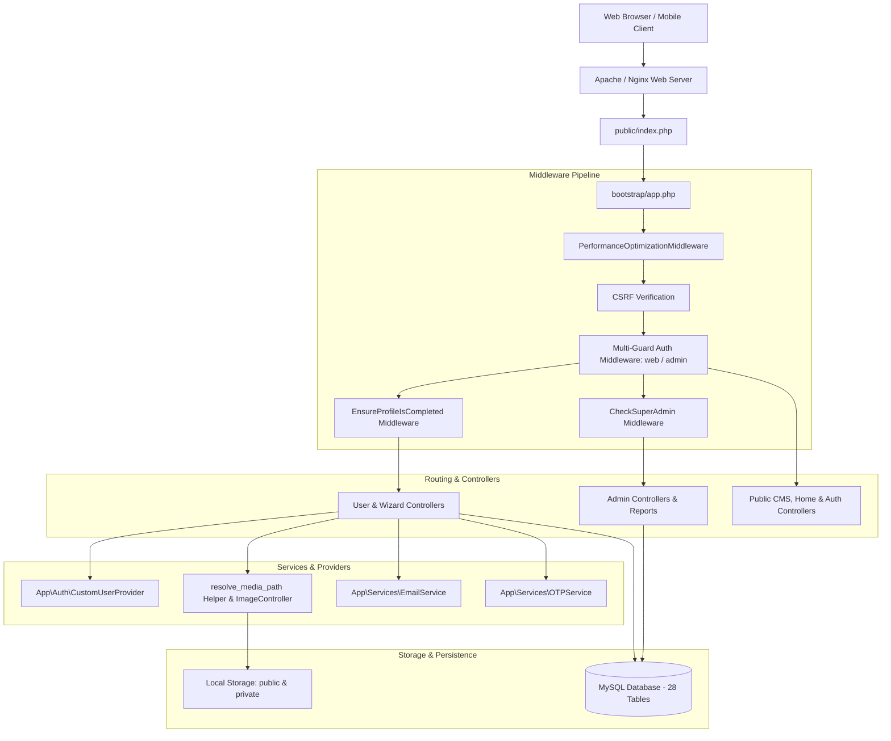
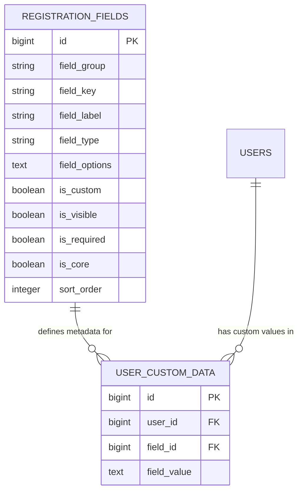
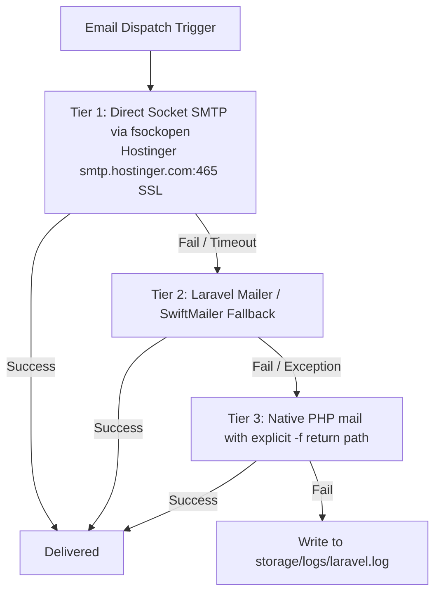

# Digambar Jain Matrimony &mdash; System Architecture & Technical Design

---

## 🏛️ 1. High-Level Architectural Pattern

The application is structured following modern **Laravel 12 MVC (Model-View-Controller)** principles combined with **Service Layers**, **Dynamic EAV (Entity-Attribute-Value)** data structures, and **Multi-Tier Fallback Infrastructures**.



---

## 🔐 2. Authentication Architecture

The application uses **dual-guard session-based authentication** in `config/auth.php`:

```php
'guards' => [
    'web' => [
        'driver' => 'session',
        'provider' => 'users',
    ],
    'admin' => [
        'driver' => 'session',
        'provider' => 'admins',
    ],
],
```

### 2.1 Candidate Authentication (`web` guard)
- **Model**: `App\Models\User` (table: `users`)
- **Provider**: Custom provider registered as `custom-users` mapped to `App\Auth\CustomUserProvider`.
- **Key Features**:
  1. **Dual Login Identifier**: Candidates can log in with either their **Email** or **Mobile number** (clean 10-digit format).
  2. **Legacy Password Handling**: The `users` table historically had two password columns (`password` and `password_hash`). Eloquent maps `getAuthPassword()` and `getAuthPasswordName()` directly to `password_hash`.
  3. **Unset Password Mobile Fallback**: For imported legacy candidates who haven't set a modern password (`has_set_password = false`), the system compares the input password against the candidate's registered mobile number (last 10 digits). Once the user updates their password, `has_set_password` becomes `true`.

### 2.2 Administrator Authentication (`admin` guard)
- **Model**: `App\Models\Admin` (table: `admins`)
- **Provider**: Standard Eloquent provider.
- **Roles & RBAC**:
  - `super_admin`: Full system access, including bulk messaging, system settings, membership plans, financial records, and user management.
  - `admin` / `sub_admin` / `moderator`: Profile verification, stage approval, member moderation, and inquiry review.

---

## 🛡️ 3. Middleware Pipeline & Access Gates

### 3.1 `PerformanceOptimizationMiddleware`
- **Location**: `app/Http/Middleware/PerformanceOptimizationMiddleware.php`
- Appended globally to the HTTP kernel in `bootstrap/app.php`.
- Injects standard web security headers:
  - `X-Content-Type-Options: nosniff`
  - `X-Frame-Options: SAMEORIGIN`
  - `X-XSS-Protection: 1; mode=block`
  - `Referrer-Policy: strict-origin-when-cross-origin`
- Dynamically sets cache control headers (`public, max-age=60`) for public non-authenticated GET requests while bypassing authentication and admin pages.

### 3.2 `EnsureProfileIsCompleted`
- **Location**: `app/Http/Middleware/EnsureProfileIsCompleted.php`
- Applied to all candidate dashboard and profile routes (`['auth:web', 'profile.completed']`).
- **Gating Logic**:
  - `status === 'account_approved'`: Must complete the 4-step registration wizard &rarr; redirects to `/registration-wizard`.
  - `status === 'pending'`: Has submitted wizard, awaiting admin approval &rarr; redirects to `/waiting-approval` (allowed to view/edit self profile).
  - `status === 'rejected'`: Profile rejected &rarr; allowed only to view/edit and resubmit profile (`/profile`, `/profile/edit`, `/profile/resubmit`).
  - `status === 'approved'`: Fully active profile &rarr; prevented from accessing `/registration-wizard` or `/waiting-approval`, redirects to `/dashboard`.
  - Any other status (e.g. `blocked`, `deactivated`): Restricted to `/waiting-approval`.

### 3.3 `CheckSuperAdmin`
- **Location**: `app/Http/Middleware/CheckSuperAdmin.php`
- Protects critical administration routes:
  - Bulk Email & WhatsApp tools (`/admin/bulk-email`, `/admin/bulk-whatsapp`)
  - Dynamic Registration Field management (`/admin/registration-fields`)
  - Membership pricing plans (`/admin/membership-plans`)
  - Payment records & manual transactions (`/admin/payments`)
  - System settings & configuration (`/admin/settings`)
  - Advanced export reports (`/admin/reports`)
  - CMS announcements and ads (`/admin/cms/*`)
- Returns `403 Forbidden` if the authenticated admin does not have `role === 'super_admin'`.

---

## 🧩 4. Dynamic Field Engine (Entity-Attribute-Value - EAV)

To allow the committee to add custom fields to the registration wizard and edit forms without modifying database tables, a lightweight EAV system is implemented:



1. **`RegistrationField` (`registration_fields`)**: Holds field definitions (label, input type e.g. text/dropdown/radio/file, group section, validation rules).
2. **`UserCustomData` (`user_custom_data`)**: Stores user-specific responses linked by `user_id` and `field_id`.
3. Rendered automatically on:
   - Registration Wizard (`resources/views/user/wizard.blade.php`)
   - Profile Edit Page (`resources/views/user/edit.blade.php`)
   - Candidate Details View (`resources/views/user/detail.blade.php`)
   - Admin Member Verification Sheet (`resources/views/admin/members/show.blade.php`)

---

## 📦 5. Resilient Media & Storage Architecture

Candidates upload profile photos, family pictures, Aadhaar/ID proofs, and UPI payment screenshots. Because files may exist across legacy directories (`../digambar-samaj/`), public uploads, or private storage, the platform uses a unified resolver:

### 5.1 `resolve_media_path(?string $filePath): ?string`
- Global helper in `app/helpers.php`.
- Scans up to 23 candidate filesystem paths in priority order (storage/app/public, storage/app/private, public/uploads, imports, legacy base folders).
- Performs case-insensitive filename fallback matches if exact paths have different casing or timestamps.

### 5.2 Secure Media Streaming via `ImageController`
- Endpoint: `/image?file={path}`
- **Security Check**: For confidential documents (`_idproof_`, `_payment_`, `receipts`), access is restricted to:
  1. System Admins (`Auth::guard('admin')->check()`)
  2. The candidate who owns the document (`Auth::id() === $owner->id`)
- **Gating of Pending Profiles**: Photos of non-approved profiles cannot be viewed by other candidates; unapproved user photos return a placeholder ("Profile Under Review").
- Sends proper MIME headers (`image/jpeg`, `image/png`, `image/webp`, `application/pdf`) and HTTP caching headers (`max-age=86400`).

---

## 📧 6. Multi-Tiered Communication Service

Email deliverability on shared hosting can be unreliable if standard PHP `mail()` or background queues fail. The platform utilizes a 3-tier fallback engine in `app/Services/EmailService.php`:



This guarantees 100% dispatch reliability for:
- 6-digit OTP verification codes during registration.
- Stage 1 Account Approval notices.
- Stage 2 Profile Approval / Rejection with explanation.
- Password Reset links.
- Payment Receipt notifications sent to admins.
