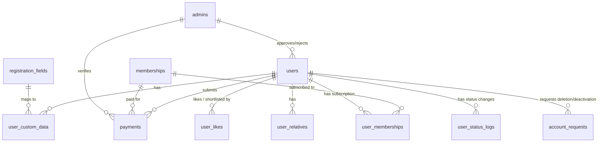

# Digambar Jain Matrimony &mdash; Database Schema & Models Reference

---

## 🗄️ 1. Database Overview

- **Engine**: InnoDB (MySQL 8.0+ / MariaDB 10.4+)
- **Character Set**: `utf8mb4`
- **Collation**: `utf8mb4_unicode_ci`
- **Migration Strategy**: Additive migrations with graceful `Schema::hasTable` and `Schema::hasColumn` guards ensuring non-destructive operation on live production environments.

---

## 📋 2. Comprehensive Table Catalog

The platform contains 28 tables supporting all core features, imports, payments, RBAC, and CMS operations.

---

### 2.1 `users` (Main Candidate Table)
Stores candidate accounts, personal info, horoscope details, family background, temple verification, contact information, and approval statuses.

| Column | Type | Nullable | Default | Description |
|---|---|---|---|---|
| `id` | `BIGINT UNSIGNED` | No | Auto Inc | Primary Key |
| `profile_id` | `VARCHAR(50)` | Yes | NULL | Unique candidate match ID (e.g. `JDM123456`) |
| `full_name` | `VARCHAR(255)` | No | - | Candidate's full legal name |
| `email` | `VARCHAR(255)` | Yes | NULL | Login and notification email (soft-delete aware unique) |
| `mobile` | `VARCHAR(20)` | Yes | NULL | Primary contact / login mobile (10 digits) |
| `country_code` | `VARCHAR(10)` | Yes | '+91' | Country calling code (e.g. `+91`, `+1`) |
| `password_hash` | `VARCHAR(255)` | Yes | NULL | Bcrypt hashed password used for web guard auth |
| `password` | `VARCHAR(255)` | Yes | NULL | Legacy password column maintained for compatibility |
| `has_set_password` | `TINYINT(1)` | No | 1 | Boolean: indicates if user explicitly set a password |
| `are_you_digambar_jain` | `VARCHAR(50)` | Yes | 'Yes' | Community eligibility flag ('Yes' / 'No') |
| `filled_by` | `VARCHAR(100)` | Yes | 'Self' | Relationship of person registering (Self, Father, etc.) |
| `gender` | `VARCHAR(50)` | Yes | NULL | 'Male' or 'Female' |
| `birth_date` | `DATE` | Yes | NULL | Date of birth |
| `birth_time` | `VARCHAR(50)` | Yes | NULL | Time of birth (supports 'HH:MM:SS' and 'hh:mm AM/PM') |
| `birth_place` | `VARCHAR(255)` | Yes | NULL | City/town of birth |
| `native_place` | `VARCHAR(255)` | Yes | NULL | Native ancestral place / village |
| `cast` | `VARCHAR(100)` | Yes | 'Digambar Jain' | Primary caste |
| `subcast` | `VARCHAR(100)` | Yes | NULL | Subcaste (Khandelwal, Agrawal, Oswal, Porwal, etc.) |
| `custom_subcast` | `VARCHAR(100)` | Yes | NULL | User-entered subcaste if 'Other' selected |
| `gotra` | `VARCHAR(100)` | Yes | NULL | Father's Gotra |
| `mama_gotra` | `VARCHAR(100)` | Yes | NULL | Maternal Uncle's Gotra |
| `manglik` | `VARCHAR(50)` | Yes | 'No' | Astrological Manglik status ('Yes' / 'No') |
| `height` | `VARCHAR(50)` | Yes | NULL | Height (e.g. `5' 8"`) |
| `weight` | `VARCHAR(50)` | Yes | NULL | Weight string (e.g. `68 kg`) |
| `weight_kg` | `DECIMAL(5,2)` | Yes | NULL | Weight numeric float for calculation queries |
| `marital_status` | `VARCHAR(50)` | Yes | 'Never Married' | 'Never Married', 'Widow', 'Widower', 'Divorce' |
| `handicapped` | `VARCHAR(50)` | Yes | 'No' | Physical deficiency / handicap flag ('Yes' / 'No') |
| `higher_education` | `VARCHAR(255)` | Yes | NULL | Educational degree (B.Tech, MBBS, CA, MBA, etc.) |
| `occupation` | `VARCHAR(100)` | Yes | NULL | Profession (Job, Business, Not Working, etc.) |
| `company_name` | `VARCHAR(255)` | Yes | NULL | Employer / organization name |
| `designation` | `VARCHAR(100)` | Yes | NULL | Job title / designation |
| `monthly_income` | `DECIMAL(12,2)` | Yes | NULL | Income amount (numeric) |
| `income_type` | `VARCHAR(50)` | Yes | 'Yearly' | Frequency of income ('Monthly' / 'Yearly') |
| `father_name` | `VARCHAR(255)` | Yes | NULL | Father's full name |
| `father_mobile` | `VARCHAR(20)` | Yes | NULL | Father's contact number |
| `father_occupation` | `VARCHAR(100)` | Yes | NULL | Father's profession |
| `father_income` | `DECIMAL(12,2)` | Yes | NULL | Father's annual/monthly income |
| `mother_name` | `VARCHAR(255)` | Yes | NULL | Mother's full name |
| `mother_mobile` | `VARCHAR(20)` | Yes | NULL | Mother's contact number |
| `mother_occupation` | `VARCHAR(100)` | Yes | NULL | Mother's profession |
| `mother_occupation_details` | `VARCHAR(255)` | Yes | NULL | Extra details for mother's job |
| `brothers` | `INT` | Yes | 0 | Total brother count |
| `brothers_married` | `INT` | Yes | 0 | Married brother count |
| `brothers_unmarried` | `INT` | Yes | 0 | Unmarried brother count |
| `sisters` | `INT` | Yes | 0 | Total sister count |
| `sisters_married` | `INT` | Yes | 0 | Married sister count |
| `sisters_unmarried` | `INT` | Yes | 0 | Unmarried sister count |
| `mandir_name` | `VARCHAR(255)` | Yes | NULL | Local Digambar Jain temple name |
| `mandir_address` | `TEXT` | Yes | NULL | Temple street address |
| `mandir_pincode` | `VARCHAR(20)` | Yes | NULL | Temple postal code |
| `ref1_name` | `VARCHAR(255)` | Yes | NULL | Community Reference 1 name |
| `ref1_mobile` | `VARCHAR(20)` | Yes | NULL | Reference 1 mobile number |
| `ref1_relation` | `VARCHAR(100)` | Yes | NULL | Reference 1 relation |
| `ref2_name` | `VARCHAR(255)` | Yes | NULL | Community Reference 2 name |
| `ref2_mobile` | `VARCHAR(20)` | Yes | NULL | Reference 2 mobile number |
| `ref2_relation` | `VARCHAR(100)` | Yes | NULL | Reference 2 relation |
| `permanent_address` | `TEXT` | Yes | NULL | Permanent hometown address |
| `current_address` | `TEXT` | Yes | NULL | Current residing address |
| `pin_code` | `VARCHAR(20)` | Yes | NULL | Residential PIN code |
| `languages` | `TEXT` | Yes | NULL | Comma-separated languages known |
| `hobbies` | `TEXT` | Yes | NULL | Interests and hobbies |
| `partner_preference` | `TEXT` | Yes | NULL | Partner expectations description |
| `profile_photo` | `VARCHAR(255)` | Yes | NULL | Candidate photo file path |
| `family_photo` | `VARCHAR(255)` | Yes | NULL | Family photo file path |
| `id_proof_type` | `VARCHAR(100)` | Yes | NULL | 'Aadhaar Card', 'Passport', 'Driving License', etc. |
| `id_proof_path` | `VARCHAR(255)` | Yes | NULL | Government ID document path |
| `payment_screenshot` | `VARCHAR(255)` | Yes | NULL | UPI payment receipt screenshot path |
| `payment_transaction_id` | `VARCHAR(255)` | Yes | NULL | UPI / UTR Transaction ID |
| `payment_status` | `VARCHAR(50)` | Yes | 'pending' | 'pending', 'approved', 'rejected' |
| `status` | `VARCHAR(50)` | No | 'account_approved' | 'account_pending', 'account_approved', 'pending', 'approved', 'rejected', 'blocked', 'deleted' |
| `is_approved` | `TINYINT(1)` | Yes | 0 | Boolean flag indicating admin profile approval |
| `is_public` | `TINYINT(1)` | Yes | 0 | Profile visibility flag (live in search results) |
| `verified` | `TINYINT(1)` | Yes | 0 | Candidate verification flag |
| `approved_by` | `BIGINT UNSIGNED` | Yes | NULL | FK &rarr; `admins.id` (Approving admin) |
| `approved_at` | `DATETIME` | Yes | NULL | Timestamp of approval |
| `approval_date` | `DATE` | Yes | NULL | Profile activation date |
| `expiry_date` | `DATE` | Yes | NULL | Profile expiration date (12 months from approval) |
| `rejection_reason` | `TEXT` | Yes | NULL | Admin feedback on rejection |
| `rejected_at` | `DATETIME` | Yes | NULL | Timestamp of rejection |
| `rejected_by` | `BIGINT UNSIGNED` | Yes | NULL | FK &rarr; `admins.id` |
| `blocked_at` | `DATETIME` | Yes | NULL | Timestamp of blocking/suspension |
| `submitted_for_review_at` | `DATETIME` | Yes | NULL | Timestamp of resubmission |
| `registration_step` | `TINYINT` | No | 1 | Wizard progress tracker (1 to 4) |
| `registration_count` | `INT` | No | 1 | Number of times account re-registered |
| `deletion_count` | `INT` | No | 0 | Number of times account requested deletion |
| `delete_reason` | `VARCHAR(255)` | Yes | NULL | Explanation provided when deleting account |
| `deleted_at` | `DATETIME` | Yes | NULL | Soft-delete timestamp (`SoftDeletes`) |
| `created_at` / `updated_at` | `TIMESTAMP` | Yes | NULL | Standard Laravel timestamps |

---

### 2.2 `admins` (Administration & RBAC)
Stores administration accounts and role privileges.

| Column | Type | Description |
|---|---|---|
| `id` | `BIGINT UNSIGNED` | Primary Key |
| `name` | `VARCHAR(150)` | Admin display name |
| `email` | `VARCHAR(150)` | Unique admin login email |
| `password_hash` | `VARCHAR(255)` | Bcrypt hashed password |
| `role` | `ENUM('super_admin', 'admin', 'moderator', 'sub_admin')` | RBAC role |
| `status` | `TINYINT(1)` | Active/Inactive toggle |
| `last_login` | `DATETIME` | Last successful login timestamp |
| `last_login_ip` | `VARCHAR(45)` | IP address of last login |
| `password_updated_at` | `DATETIME` | Timestamp of password change |
| `two_factor_enabled` | `TINYINT(1)` | 2FA toggle |
| `created_at` / `updated_at` | `TIMESTAMP` | Timestamps |

---

### 2.3 `payments` (Financial Transactions & Verification)
Stores all offline UPI receipt uploads and manual transaction entries.

| Column | Type | Description |
|---|---|---|
| `id` | `BIGINT UNSIGNED` | Primary Key |
| `user_id` | `BIGINT UNSIGNED` | FK &rarr; `users.id` |
| `membership_id` | `BIGINT UNSIGNED` | FK &rarr; `memberships.id` |
| `amount` | `DECIMAL(10,2)` | Paid amount in INR (₹) |
| `transaction_id` | `VARCHAR(255)` | Unique UPI / bank UTR reference |
| `payment_method` | `VARCHAR(100)` | Payment mode ('UPI / Online Receipt', 'Screenshot', 'Cash') |
| `payment_screenshot` | `VARCHAR(255)` | Storage path to receipt file |
| `status` | `ENUM('pending', 'verified', 'rejected')` | Admin verification status |
| `verified_by` | `BIGINT UNSIGNED` | FK &rarr; `admins.id` |
| `full_name` / `phone_number` / `email` / `address` / `dob` | `VARCHAR/TEXT/DATE` | Form snapshot backup fields |
| `created_at` / `updated_at` | `TIMESTAMP` | Timestamps |

---

### 2.4 `registration_fields` & `user_custom_data` (EAV Dynamic Fields)

#### `registration_fields`
- `id` (PK)
- `field_group`: Group category ('Section 1: Basic Information', 'Section 2: Personal Details', 'Section 3: Family Details', 'Section 4: Mandir Verification Details', 'Custom Fields')
- `field_key`: Unique slug key (e.g. `custom_kundali_milan`)
- `field_label`: Display label shown in forms
- `field_type`: `text`, `number`, `textarea`, `dropdown`, `radio`, `checkbox`, `date`, `file`
- `field_options`: Comma-separated list for select/radio/checkbox options
- `is_custom`: Boolean (1 for dynamic custom fields, 0 for system fields)
- `is_visible`: Boolean (toggle field visibility across the site)
- `is_required`: Boolean (validation requirement)
- `sort_order`: Integer sorting index

#### `user_custom_data`
- `id` (PK)
- `user_id` (FK &rarr; `users.id`)
- `field_id` (FK &rarr; `registration_fields.id`)
- `field_value`: `TEXT` storing the candidate's custom input or uploaded file path
- `UNIQUE(user_id, field_id)`

---

### 2.5 `user_likes` (Shortlists / Favorites)
- `id` (PK)
- `user_id` (FK &rarr; `users.id` - who shortlisted)
- `liked_user_id` (FK &rarr; `users.id` - shortlisted candidate)
- `UNIQUE(user_id, liked_user_id)`

---

### 2.6 `advertisements` & `marquee_ads` (Ad & Notice Banners)

#### `advertisements`
- `id` (PK)
- `title`: Ad campaign title
- `image`: Image file path or Base64 data string
- `link`: Click-through destination URL
- `position`: Position slot (`home_top`, `left_sidebar`, `center_left`, `center_right`, `right_sidebar`, `home_bottom`, `latest_profiles_bottom`, `footer`)
- `status`: Active toggle (1/0)
- `sort_order`: Display sequence

#### `marquee_ads`
- `id` (PK)
- `notice_text`: Ticker headline in Hindi or English
- `status`: Active toggle (1/0)

---

### 2.7 `committee_members` (Samaj Leadership & Board)
- `id` (PK)
- `name` (Hindi) / `name_en` (English)
- `designation` (Hindi) / `designation_en` (English)
- `description` (Hindi) / `description_en` (English)
- `photo`: Asset image path or external URL
- `sort_order`: Display priority
- `status`: Active toggle (1/0)

---

### 2.8 Other Supporting Tables

| Table Name | Primary Purpose | Key Columns |
|---|---|---|
| `site_settings` | Key-Value platform configurations & CMS text | `setting_key`, `setting_value` |
| `news` | News articles & event announcements | `title`, `content`, `image`, `status` |
| `scrolling_news` | Top header scrolling news ticker items | `content`, `link`, `status` |
| `gallery` | Photo albums & event photographs | `title`, `category`, `image_path`, `media_type` |
| `video_gallery` | Embedded YouTube videos & events | `title`, `video_type`, `video_url`, `thumbnail` |
| `success_stories` | Married couple testimonials | `couple_name`, `marriage_date`, `story`, `photo`, `status` |
| `contact_messages`| Inquiries sent from Contact Us page | `name`, `email`, `mobile`/`phone`, `subject`, `message`, `status` |
| `memberships` | Subscription packages & pricing plans | `plan_name`, `price`, `duration_days`, `contact_limit`, `status` |
| `user_memberships`| Member subscription history | `user_id`, `membership_id`, `start_date`, `end_date`, `status` |
| `otp_verifications`| 6-digit OTP verification codes | `email`, `otp_code`, `expires_at`, `verified` |
| `password_resets` | Password reset tokens | `email`, `token`, `created_at` |
| `account_requests`| User deactivation/deletion logs | `user_id`, `request_type`, `reason`, `status` |
| `user_status_logs`| Audit log of candidate status changes | `user_id`, `status`, `reason`, `performed_by`, `performed_by_type` |
| `activity_logs` | Admin and user action auditing | `user_type`, `user_id`, `action`, `details`, `ip_address` |
| `members` | Staging import table for bulk migrations | `full_name`, `gender`, `birth_date`, `profile_photo_path` |
| `import_images` | Staged image import metadata | `image_type`, `member_name_key`, `file_name`, `file_path` |
| `import_history` | Historical logs of bulk data imports | `source_type`, `imported_records`, `imported_by`, `import_date` |
| `cache` / `jobs` | Laravel native caching & queue management | Standard Laravel schema |
