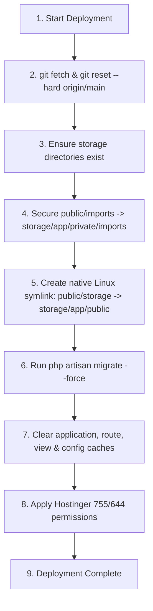

# Digambar Jain Matrimony &mdash; Deployment & Operations Guide

---

## 🚀 1. Production Deployment Workflow

The production environment is hosted on a Linux / Hostinger / cPanel setup running PHP 8.2+ and MySQL. The repository includes an automated deployment script `deploy.sh`.

### 1.1 Triggering Deployment
Execute the script from the project root directory:

```bash
bash deploy.sh
```

### 1.2 Deployment Script Lifecycle (`deploy.sh`)



1. **Hard Reset to Main**: `git fetch origin main && git reset --hard origin/main` ensures local changes on production never cause merge conflicts.
2. **Directory Provisioning**: Creates `storage/app/public/uploads`, `storage/app/private/imports`, `storage/framework/cache/data`, `storage/framework/sessions`, `storage/framework/views`, and `storage/logs`.
3. **Sensitive Data Protection**: Moves any unshielded files from `public/imports` into `storage/app/private/imports` to prevent direct public directory browsing.
4. **Native Storage Symlink**: Uses `ln -sfn "$PWD/storage/app/public" "$PWD/public/storage"` to bypass shared hosting PHP `disable_functions` restrictions on `symlink()`.
5. **Database Migration**: Executes `php artisan migrate --force` applying any new schema tables or column adjustments.
6. **Cache Invalidation**: Runs `php artisan optimize:clear`, `config:clear`, `cache:clear`, `route:clear`, `view:clear`.
7. **Permission Hardening**:
   - `chmod -R 755 .` (Directories)
   - `chmod -R 775 storage bootstrap/cache` (Writable storage)
   - `find . -type f -exec chmod 644 {} +` (File permissions avoiding Hostinger 403 Forbidden errors)
   - `chmod +x deploy.sh`

---

## ⚙️ 2. Environment Configuration (`.env`)

Essential `.env` configurations for production operation:

```ini
APP_NAME="Jain Matrimony"
APP_ENV=production
APP_KEY=base64:...
APP_DEBUG=false
APP_URL=https://digambarjainparichay.com

LOG_CHANNEL=stack
LOG_LEVEL=error

DB_CONNECTION=mysql
DB_HOST=127.0.0.1
DB_PORT=3306
DB_DATABASE=your_database_name
DB_USERNAME=your_database_user
DB_PASSWORD=your_secure_password

# Multi-Tier Socket SMTP (Hostinger Direct SSL)
MAIL_MAILER=smtp
MAIL_HOST=smtp.hostinger.com
MAIL_PORT=465
MAIL_USERNAME=help@digambarjainparichay.com
MAIL_PASSWORD=your_mail_password
MAIL_ENCRYPTION=ssl
MAIL_FROM_ADDRESS="help@digambarjainparichay.com"
MAIL_FROM_NAME="Jain Digambar Matrimony"

SESSION_DRIVER=file
SESSION_LIFETIME=120
CACHE_STORE=file
```

---

## 🧰 3. Common Operational Tasks & Maintenance Recipes

### 3.1 Clearing View and Application Caches Manually
If changes to Blade templates, advertisements, or settings are not immediately visible:

```bash
php artisan optimize:clear
php artisan view:clear
php artisan cache:clear
php artisan config:clear
```
*Alternatively, visit `/public/clear_cache.php` or `/dbcheck` from an admin browser session.*

### 3.2 Seeding Admin Accounts
To initialize or restore the default administrators:

```bash
php artisan db:seed
```
*Or execute migration `2026_08_19_000002_setup_rbac_admin_accounts.php` which configures 2 Super Admins and 2 Sub Admins.*

### 3.3 Visitor Counter Reset
The visitor counter can be reset via:
- Visiting `/api/reset-visitor-count?secret=jdm_reset_key_2026&value=0`
- Or directly modifying `setting_value` for `setting_key = 'visitor_count'` in `site_settings` table.

---

## 🚨 4. Troubleshooting & Gotchas

1. **MySQL 0000-00-00 Date Error on Legacy Tables**:
   - Migration `2026_07_30_000001_patch_legacy_users_table.php` automatically sets `SET SESSION sql_mode = ''` and nullifies invalid `0000-00-00` dates in `birth_date`, `created_at`, and `last_login`.
2. **Missing Profile Photos or 404 on Legacy Uploads**:
   - `resolve_media_path` in `app/helpers.php` dynamically searches both `storage/app/public` and legacy paths (`../digambar-samaj/uploads`). Ensure the `public/storage` symlink points to `storage/app/public`.
3. **Session Expiry During Long Registrations**:
   - CSRF tokens are exempted on `/registration-wizard/*` in `bootstrap/app.php` so users taking time to fill family and horoscope details do not encounter 419 Page Expired errors.
4. **Mobile Regex Validation**:
   - Mobile numbers across all controllers are validated and normalized using 10 numeric digits regex `/^[0-9]{10}$/`.
