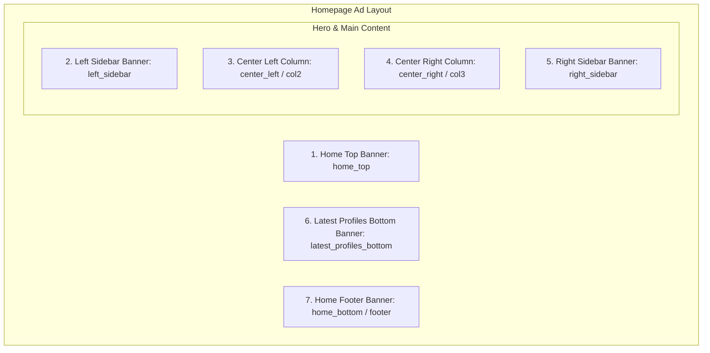

# Digambar Jain Matrimony &mdash; Modules & Features Catalog

---

## 🔍 1. Candidate Search & Matchmaking Engine

- **Controller**: `App\Http\Controllers\User\ProfileSearchController`
- **View**: `resources/views/user/search.blade.php`

### 1.1 Automatic Gender Alignment
- By default, logged-in candidates automatically see candidates of the **opposite gender** (e.g. Male users see Female profiles, Female users see Male profiles).
- Filterable manually by clicking 'Boy' / 'Girl' toggle tabs.

### 1.2 Search Filters Matrix

| Filter | Query Parameter | Matching Algorithm |
|---|---|---|
| **Match ID** | `match_id` | Strips prefix/plus signs, matches `profile_id` (e.g. `JDM123456`, `M-123456`) or database `id`. Bypasses other filters for direct lookups. |
| **City / Native Place** | `city` | Matches `native_place`, `current_address`, `permanent_address`, or `birth_place`. |
| **State** | `state` | Matches state names in `current_address`, `permanent_address`, or `native_place`. |
| **Higher Education** | `education` | Categorized matching:  • **Doctors**: `MBBS`, `MD`, `BDS`, `BAMS`, `BHMS`, `MDS`, `Surgery` • **Engineers**: `B.E`, `B.Tech`, `M.Tech` • **MBA/MCA**: `MBA`, `PGDM`, `PGBDM`, `MCA` • **CA/CS**: `Chartered Accountant`, `CA`, `Company Secretary`, `CS` • **Graduates**: `B.Com`, `B.Sc`, `B.A`, `BBA`, `BCA` • **Post Graduates**: `M.Com`, `M.Sc`, `M.A`, `Master` |
| **Manglik Status** | `manglik` | Matches `manglik = 'Yes'` or `manglik = 'No'`. |
| **Marital Status** | `marital` | Matches `'Never Married'`, `'Widow'`, `'Divorce'`. |
| **Occupation** | `occupation` | Categorized matching: • **Business**: `Business`, `Self Employed`, `Owner`, `Entrepreneur` • **Service**: `Job`, `Service`, `Private`, `Govt`, `Government` • **Not Working**: `Housewife`, `Retired`, `Unemployed`, `Student`, empty |
| **Age Range** | `age_from`, `age_to` | Translates integer age range into dynamic date bounds against `birth_date`. |
| **NRI Status** | `nri` | Matches non-`+91` calling codes and foreign addresses (USA, UK, Canada, UAE, Australia, Singapore, Europe, etc.). |

### 1.3 Sorting & Shortlisting
- **Sort Options**: Name (A-Z, Z-A), Age (Youngest, Oldest), or Latest registered (`id desc`).
- **Shortlisting**: Candidates can click the heart icon to toggle shortlisting via AJAX (`/profiles/{profile}/like`). Shortlisted profiles appear at the top of subsequent searches.

### 1.4 Printable Bio-Data / PDF Export
- Route: `/profiles/{profile}/pdf`
- Generates a clean, print-ready matrimonial bio-data layout complete with profile photograph, horoscope box, personal details, education/profession, family background, temple verification, and community references.

---

## 🎨 2. Photo Editor & Server-Side Image Rotation

- **Controller**: `App\Http\Controllers\User\PhotoEditorController`
- **Route**: `POST /user/profile/photo/rotate`
- Allows candidates to correct image orientation (e.g. photos taken sideways on mobile phones) directly in their profile editor.
- Reads image via PHP GD library (`imagecreatefromjpeg`, `imagecreatefrompng`, `imagecreatefromwebp`), applies `imagerotate($img, $degrees, 0)`, and re-saves the optimized image preserving quality.

---

## 📢 3. Advertisement Engine & Banner Rotators

- **Controller**: `App\Http\Controllers\Admin\AdvertisementController`
- **Views**: Embedded in `home.blade.php`, `layouts/header.blade.php`, `layouts/footer.blade.php`

The platform supports 7 distinct responsive advertisement slots with image, external click URL, and active toggle:

---

## 📊 4. High-Performance Atomic Visitor Counter

- **Controller**: `App\Http\Controllers\VisitorCountController`
- **Route**: `/api/track-visit`
- **Architecture**:
  1. Executes asynchronously via lightweight AJAX request on page load without blocking HTML rendering.
  2. Filters out web crawlers, search bots, and browser prefetch requests (`X-Purpose: prefetch`).
  3. Ignores logged-in system administrators to maintain authentic visitor metrics.
  4. Deduplicates visits per session (`session('visitor_tracked')`).
  5. Performs atomic SQL increment on `site_settings.setting_value` with cross-database casting support (`CAST(setting_value AS SIGNED) + 1`).
  6. Automatically purges cached settings so the admin dashboard counter reflects real-time numbers.

---

## 📰 5. Content Management System (CMS)

### 5.1 Announcements & Marquees
- **News (`NewsController`)**: Publish news articles, community announcements, and photos.
- **Marquee Tickers (`NewsController`)**: Top-of-page continuous scrolling headlines with custom speed and links.
- **Scrolling News Header**: Top banner ticker items for instant alerts.

### 5.2 Galleries & Testimonials
- **Photo Gallery (`GalleryController`)**: Filterable photo albums categorized by events and community gatherings.
- **Video Gallery (`GalleryController`)**: Embedded YouTube and MP4 video player showcase.
- **Success Stories (`SuccessStoryController` & `MediaController`)**: Verified married couple testimonials with engagement/marriage dates and couple photographs.

### 5.3 Community Leadership & Board
- **Committee (`CommitteeController` & `CmsController`)**: Bi-lingual directory (Hindi & English) showcasing founding members, patrons, executive trustees, and technical contributors.

---

## 💳 6. Memberships & Financial Management

- **Controllers**: `App\Http\Controllers\Admin\MembershipController`, `App\Http\Controllers\Admin\PaymentController`
- **Features**:
  - Flexible Membership Plan Creation (Plan name, price, duration in days, contact limits, featured badge).
  - QR Code UPI Payment Integration (Admin uploads custom UPI QR Code from Settings).
  - Candidate receipt submission during wizard or from profile dashboard.
  - Auto-synchronization of unlinked receipt uploads into pending approval queue.
  - One-click payment verification / rejection with automated membership entitlement updates.
