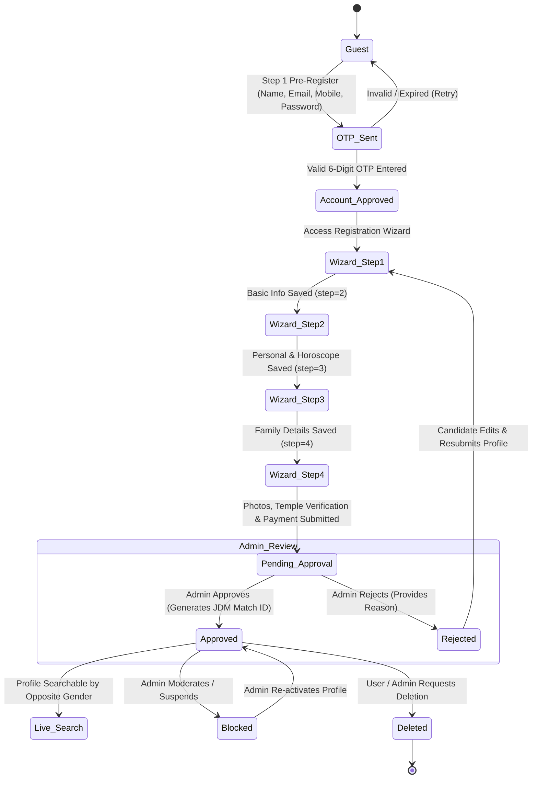

# Digambar Jain Matrimony &mdash; Candidate Registration & Verification Lifecycle

---

## 🔄 1. Complete Candidate Lifecycle & State Machine

The candidate experience follows a structured **two-stage verification process** ensuring authentic, community-validated profiles before going live.

---

## 📝 2. Stage 1: Account Pre-Registration & OTP Verification

### 2.1 Registration Form (`/register`)
- **Controller**: `App\Http\Controllers\Auth\RegisterController@register`
- **Fields**:
  - `full_name` (required, max 255)
  - `email` (required, unique among non-deleted users)
  - `mobile` (required, 10 digits regex `/^[0-9]{10}$/`, unique among non-deleted users)
  - `password` & `password_confirmation` (required, min 6 chars)
- **Flow**:
  1. Stores registration input temporarily in `session('reg_data')`.
  2. Generates a 6-digit random verification code in `otp_verifications` table (valid for 10 minutes).
  3. Dispatches verification email via `OTPService` / `EmailService`.
  4. Redirects candidate to `/register/verify-otp`.

### 2.2 OTP Verification (`/register/verify-otp`)
- **Controller**: `App\Http\Controllers\Auth\RegisterController@verifyOtp`
- **Actions on Success**:
  1. Validates OTP code against `otp_verifications` table.
  2. Checks for soft-deleted accounts with same email/mobile to allow clean account re-registration while maintaining historical audit counters (`registration_count`, `deletion_count`).
  3. Creates or updates `User` record with `status = 'account_approved'`, `registration_step = 1`, `is_public = false`.
  4. Logs candidate into the `web` session.
  5. Clears registration session and redirects to `/registration-wizard`.

---

## 🧙‍♂️ 3. Stage 2: 4-Step Profile Wizard

The wizard is handled by `App\Http\Controllers\ProfileWizardController` and saved incrementally via AJAX `POST` requests so candidates never lose data between steps.

### Step 1: Basic Information (`/registration-wizard/basic`)
- `are_you_digambar_jain` ('Yes' / 'No')
- `filled_by` ('Self', 'Father', 'Mother', 'Brother', 'Sister', 'Relative')
- `gender` ('Male' / 'Female')
- `full_name` (max 255)
- `mobile` (10 digits, validated against duplicates)
- `email` (validated against duplicates)
- Dynamic custom fields assigned to 'Section 1: Basic Information'
- Advances `registration_step` to `2`.

### Step 2: Personal & Horoscope Details (`/registration-wizard/personal`)
- `birth_date` (candidate must be at least 18 years old)
- `birth_time_hh`, `birth_time_mm`, `birth_time_ampm` (converted into standard SQL format)
- `birth_place`, `native` (ancestral native place)
- `cast` ('Digambar Jain', 'Other' with `custom_cast`)
- `subcast` ('Khandelwal', 'Agrawal', 'Oswal', 'Porwal', 'Golalare', 'Humad', 'Bagherwal', 'Chaturth', 'Pancham', 'Other' with `custom_subcast`)
- `gotra` (Father's Gotra) & `mama_gotra` (Maternal Uncle's Gotra)
- `manglik` ('Yes' / 'No')
- `height` (e.g. `5' 6"`) & `weight` (formatted with 'kg')
- `permanent_address`, `pin_code` (4 to 6 digits), `current_address`
- `education` (Higher education degree)
- `occupation` ('Job', 'Business', 'Not Working', 'Other' with `occupation_details`)
- `annual_income` / `monthly_income` & `income_type` ('Monthly' / 'Yearly')
- `company_name`, `designation`
- `hobbies`, `partner_preference`
- `marital_status` ('Never Married', 'Widow', 'Divorce')
- `handicapped` ('Yes' / 'No')
- `languages` (Array of selected languages + custom)
- Advances `registration_step` to `3`.

### Step 3: Family Details (`/registration-wizard/family`)
- `father_name`, `father_mobile`, `father_occupation`, `father_income`
- `mother_name`, `mother_mobile`, `mother_occupation`
- `brothers` count, `brothers_married` count, `brothers_unmarried` count (0 to 5)
- `sisters` count, `sisters_married` count, `sisters_unmarried` count (0 to 5)
- Advances `registration_step` to `4`.

### Step 4: Mandir Verification, Documents & Payment (`/registration-wizard/final`)
- **Temple Verification**:
  - `mandir_name` (Local Digambar Jain temple name)
  - `mandir_address`, `mandir_pincode`
- **Two Community References**:
  - `ref1_name`, `ref1_mobile`, `ref1_relation`
  - `ref2_name`, `ref2_mobile`, `ref2_relation`
  - Validation: Reference 1 and 2 mobile numbers cannot be identical, and cannot match candidate's or father's mobile number.
- **Photos & Documents**:
  - `photo` (Candidate profile picture, max 10MB)
  - `family_photo` (Optional, max 10MB)
  - `id_proof_type` ('Aadhaar Card', 'Passport', 'Voter ID', 'Driving License') & `id_proof_path` (max 10MB)
- **Payment Details**:
  - `membership_id` (Selected plan)
  - `payment_transaction_id` (Unique UPI transaction ID)
  - `payment_screenshot` (Receipt image, max 10MB)
- **Submission Output**:
  - Updates status to `pending` (or remains `approved` if already an approved member editing profile).
  - Sends submission email to candidate and alert email to `help@digambarjainparichay.com`.
  - Redirects candidate to `/waiting-approval`.

---

## ⚖️ 4. Admin Review & Verification

Administrators manage candidates through two dedicated approval queues:

### 4.1 Stage 1 Approvals (`/admin/account-approvals`)
- **Controller**: `App\Http\Controllers\Admin\AccountApprovalController`
- Lists candidates with `status = 'account_pending'` (if manual account approval mode is enabled).
- **Approve**: Sets `status = 'account_approved'` and sends an HTML login invitation email.
- **Reject**: Deletes the registration record.

### 4.2 Stage 2 Profile Approvals (`/admin/approvals`)
- **Controller**: `App\Http\Controllers\Admin\ProfileApprovalController`
- Lists completed profiles with `status = 'pending'`.
- **Approve**:
  1. Sets `status = 'approved'`, `verified = true`, `is_approved = true`.
  2. Generates unique 9-character match ID: `JDMXXXXXX` (e.g. `JDM482910`).
  3. Sets `approval_date = today` and `expiry_date = today + 12 months`.
  4. Records `approved_by` and `approved_at` timestamps.
  5. Inserts an audit record into `user_status_logs`.
  6. Dispatches `ProfileApprovedNotification` email to candidate.
  7. Candidate profile becomes live and searchable by candidates of the opposite gender.
- **Reject**:
  1. Sets `status = 'rejected'`, `is_approved = false`.
  2. Records mandatory `rejection_reason`, `rejected_by`, `rejected_at`.
  3. Inserts an audit record into `user_status_logs`.
  4. Dispatches `ProfileRejectedNotification` with the rejection explanation.
  5. Candidate can log in, edit flagged details, and resubmit via `/profile/resubmit`.

---

## 🗑️ 5. Account Deletion & Deactivation Lifecycle

Candidates have full control over their data:
- From `/profile`, candidates can click **Delete Account**, select a reason ('Married through Jain Matrimony', 'Married outside', 'Privacy concerns', or 'Other'), and confirm.
- **Backend Flow** (`App\Http\Controllers\User\ProfileController@deleteProfile`):
  1. Updates `users` record: `status = 'deleted'`, `is_public = false`, `delete_reason = reason`, `deleted_at = now()`.
  2. Increments `deletion_count`.
  3. Inserts a tracked request into `account_requests` (`request_type = 'deletion'`, `status = 'processed'`).
  4. Invalidate web session and logs user out with success notification.
  5. Admin can review historical deletion logs at `/admin/members-requests`.
